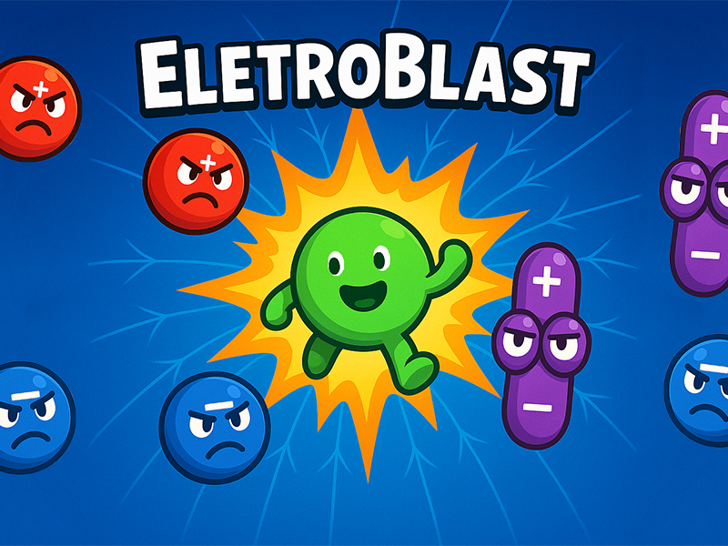

# ⚡ EletroBlast 🎮

EletroBlast é um jogo 2D educativo inspirado na mecânica de *Bomberman*, desenvolvido para apoiar o ensino de conceitos fundamentais de **Eletromagnetismo** (Física 3). O jogador, representando uma **carga neutra**, enfrenta inimigos que representam diferentes tipos de cargas elétricas e dipolos, utilizando campos elétricos para atraí-los ou repelí-los e assim destruí-los estrategicamente.



---

## 🧪 Conteúdos de Física Envolvidos

- Tipos de carga elétrica (positiva, negativa, neutra)
- Interações eletrostáticas (atração e repulsão)
- Campo elétrico 
- Dipolos elétricos e comportamento em campos externos
- Princípio da superposição de campos
- Estratégias para neutralização e confinamento de cargas

---

## 🎮 Mecânicas do Jogo

- **Personagem principal:** Carga neutra (verde)
- **Inimigos:**
  - Cargas positivas (vermelhas)
  - Cargas negativas (azuis)
  - Dipolos elétricos (roxos)
- **Campo elétrico:** Positivo ou negativo, ativado pelo jogador
- **Eliminação:** Cargas opostas são atraídas e destruídas ao entrar no campo
- **Power-ups:**
  - `E+` → Campo elétrico adicional
  - `r+` → Aumento do raio do campo
  - `+1` → Vida extra
- **Progressão:** Inimigos aumentam em número e velocidade a cada fase

- **Controles:**
    - `w`, `A`, `S`, `D` e setas direcionais → movimentaão do jogador
    - `P` → ativação do campo elétrico positivo
    - `N` → ativação do campo elétrico negativo

---

## 🖥️ Requisitos

- Python 3.10 ou superior
- [Pygame](https://www.pygame.org/) (instale com `pip install pygame`)

---

## 🚀 Como Rodar

Clone o repositório e execute o arquivo principal:

```bash
python jogo.py
```

---
Projeto desenvolvido como recurso educacional para a disciplina de Física Teórica 3 do curso de Engenharia da Computação da Universidade Federal do Vale do São Francisco (UNIVASF).

